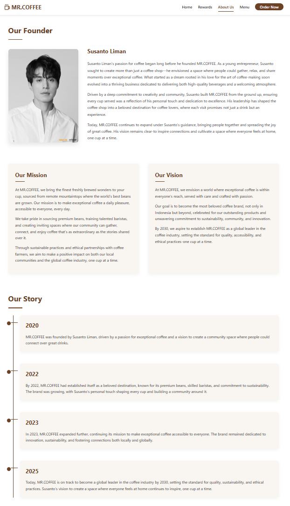

# ☕ MR.COFFEE – Roasted with Love, Served with Passion

Final project for **Human-Computer Interaction** course.  
I designed and developed a responsive website for **MR.COFFEE**, a fictional coffee shop known for its cozy vibes, artistic charm, and community spirit. The site was built using HTML, CSS, and JavaScript, and emphasizes intuitive design, usability, and mobile responsiveness.

---

## 🌐 Website Overview

This project brings MR.COFFEE's in-store experience into a digital platform, allowing users to explore menus, earn rewards, read about the company story, and place orders with ease. The website also reflects the brand’s values — warmth, creativity, and connection.

### 💡 Key Features

- **Home Page**:  
  Engaging banner, top 5 most-ordered products, highlight of current reward, and a CEO spotlight.

- **Rewards Page**:  
  Promo and reward details, app download prompts (Play Store & App Store).

- **About Us Page**:  
  Company mission, vision, full story, and CEO profile.

- **Menu Page**:  
  Interactive filterable menu (Espresso, Frappe, Bread, etc.), dynamic content switch.

- **Order Page**:  
  Functional form (with validation) for placing online orders — includes add-ons, price display, and JavaScript-based checks (without regex).

---

## ⚙️ Technologies Used

- **HTML5**  
- **CSS3** (Flexbox, Media Queries, Transitions)  
- **JavaScript** (Form Validation, Interactions)  
- **Figma** (for separate UI prototype)

---

## 📱 Responsiveness

This website is fully responsive and adapts gracefully on various devices (mobile, tablet, desktop).  
Implemented using `meta viewport` and `@media screen` rules for screens below 768px.

---

## 🎨 Figma Prototype

The website design is preceded by a Figma-based prototype that shares the same brand theme but with a different layout and style to embrace design creativity.

---
